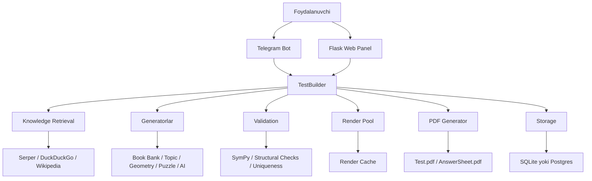
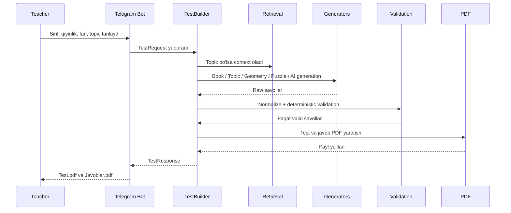
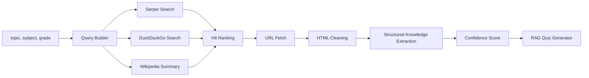
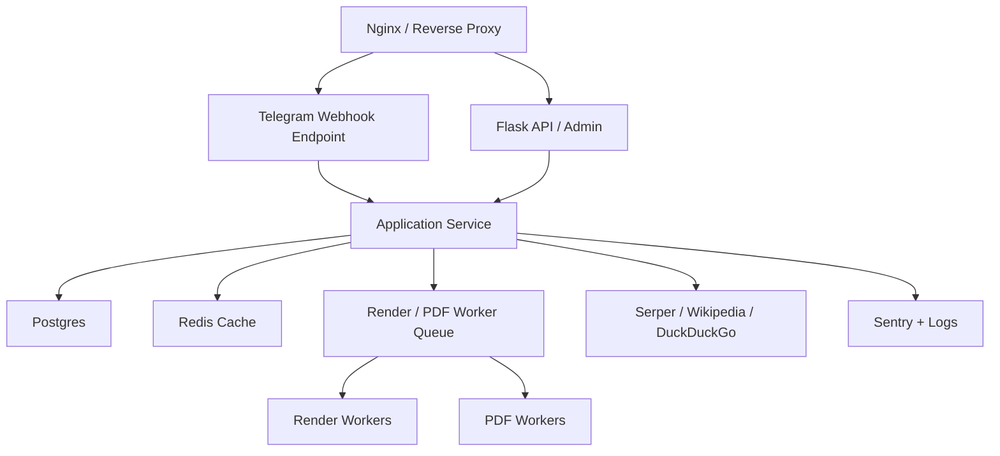

# AI_MATH To'liq Arxitektura Hujjati

## 1. Loyiha maqsadi

AI_MATH bu 1-11 sinf uchun matematika, algebra, geometriya, mantiq va puzzle testlarini yaratadigan AI-ga tayangan ta'lim platformasi. Tizimning hozirgi vazifasi faqat Telegram bot emas, balki quyidagi qatlamlarni birlashtirgan production-ready backend bo'lishdir:

- test yaratish
- internetdan bilim olish
- matematik to'g'rilikni deterministik tekshirish
- diagramma va rasmlar chizish
- PDF chiqarish
- Telegram orqali yetkazish
- web panel orqali boshqarish

## 2. Arxitektura prinsiplar

Tizim quyidagi qat'iy tamoyillarga tayanadi:

1. Generatsiya va validatsiya ajratilgan bo'lishi kerak.
2. Matematik javoblar hech qachon ko'r-ko'rona qabul qilinmaydi.
3. Har bir savol yagona schema bilan ifodalanadi.
4. Retrieval qatlamidagi barcha manbalar izchil saqlanadi.
5. Rendering mustaqil qatlam bo'lib qoladi.
6. PDF va bot qatlamlari generation logic bilan kuchli bog'lanmaydi.
7. API kalitlar faqat environment orqali boshqariladi.

## 3. Amaldagi tizim ko'rinishi



## 4. Root darajadagi kataloglar

```text
AI_MATH/
|-- bot/                  Telegram interfeysi
|-- web/                  Flask admin panel va monitoring
|-- services/             Business logic va domain servislar
|-- database/             SQLAlchemy modellari va session factory
|-- config/               Konfiguratsiya fayllari
|-- tests/                Unit va integratsion testlar
|-- data/
|   `-- cache/
|       |-- renders/      Render cache va vaqtinchalik rasm fayllari
|       |-- pdf_temp/     Test.pdf va Answer.pdf vaqtinchalik chiqishlari
|       `-- tmp/          Qisqa umrli tmp/video artefaktlar
|-- temp/                 Retrieval va boshqa yordamchi cache fayllari
|-- logs/                 app.log va aylanma loglar
|-- main.py               App entrypoint
|-- requirements.txt      Kutubxonalar ro'yxati
|-- project.md            Eski umumiy hujjat
`-- ARCHITECTURE.md       Yangi to'liq arxitektura hujjati
```

## 5. Amaldagi muhim modullar xaritasi

### 5.1 Interface Layer

`bot/`

- `bot/core.py`
  - aiogram `Bot` va `Dispatcher` ni sozlaydi
  - routerlarni ulaydi
  - polling yoki webhook rejimida ishlaydi
  - automation background task ni ishga tushiradi
- `bot/handlers/`
  - user input yig'adi
  - state machine boshqaradi
  - `TestRequest` uchun kerakli parametrlarni to'playdi

`web/`

- `web/app.py`
  - Flask app yaratadi
  - template va static papkalarni ulaydi
- `web/routes.py`
  - `/health`
  - `/settings`
  - `/add_key`
  - `/manual_trigger`
  - admin va monitoring endpointlari

### 5.2 Orchestration Layer

`services/test_builder.py`

Bu tizimning markaziy orchestrator qatlami:

- `TestRequest` qabul qiladi
- qaysi generator ishlashini tanlaydi
- retrieval ishlatish kerakmi yo'qmi hal qiladi
- savollarni normalizatsiya qiladi
- validator ishlatadi
- renderlarni chaqiradi
- PDF yaratadi
- `TestResponse` qaytaradi

Asosiy ichki javobgarliklar:

- `suggest_topics`
- `_generate_book_questions`
- `_generate_rag_questions`
- `_generate_ai_questions`
- `_validate_and_normalize_questions`
- `_generate_test_pdf`
- `_generate_answers_pdf`

### 5.3 Knowledge Retrieval Layer

`services/knowledge_retriever.py`

Vazifalari:

- topic bo'yicha query tuzish
- Serper qidiruvi
- DuckDuckGo HTML qidiruvi
- Wikipedia summary qidiruvi
- topilgan URLlardan kontent olish
- HTML noise tozalash
- educational matnni ajratish
- structured knowledge formatga o'tkazish
- disk cache orqali qayta ishlatish

Chiqish formati:

```python
{
    "content": "...",
    "sources": [...],
    "confidence": 0.0,
    "structured": {
        "definitions": [],
        "formulas": [],
        "rules": [],
        "examples": [],
        "important_facts": [],
    },
    "query": "..."
}
```

`services/topic_context_service.py`

- mavzu nomini normalize qiladi
- subject va topic asosida quiz turini aniqlaydi
- topicga mos bo'lmagan savollarni filtrlab tashlaydi
- internet context snippetlarini yig'adi
- AI ishlamasa deterministic local topic fallback savol quradi

`services/rag_quiz_generator.py`

- retrieval natijasi asosida savol yaratadi
- formula-based savollar
- fact-based savollar
- source traceability saqlaydi
- deterministic validation dan o'tgan savollarnigina qaytaradi

### 5.4 Generation Layer

`services/topic_generator.py`

- akademik savollar generatori
- mavzu, sinf va qiyinlikka mos savollar

`services/book_question_bank.py`

- kitob yoki bank usulidagi tayyor savollar
- topic strict filtering qo'llab-quvvatlaydi

`services/ai_generator.py`

- AI asosida savol yaratadi
- internet context bilan prompt boyitadi
- validation metadata qaytarishga harakat qiladi
- fallback generation bilan ishlaydi
- image artefaktlarni xavfsiz cache papkasiga yozadi

`services/geometry_pool.py`

- geometriya savollarini yaratadi
- render spec bilan birga qaytaradi

`services/puzzle_engine.py`

- template-driven puzzle orchestrator
- parameter generation
- structural validation
- uniqueness tracking
- render spec generation

`services/puzzle_pool.py`

- mantiqiy va puzzle savollarni yig'adi

`services/hybrid_puzzle_generator.py`

- bir nechta savol turini birlashtiradi
- masalan:
  - arithmetic_chain_grid
  - flow_symbol
  - vertical_magic
  - chain_equation
  - grid_pattern

### 5.5 Validation Layer

`services/question_schema.py`

Yagona schema:

```python
class QuestionItem:
    id: str
    subject: str
    topic: str
    grade: int
    difficulty: str
    type: str
    question_text: str
    options: list[str] | None
    correct_answer: Any
    explanation: str
    metadata: dict
    render_spec: dict | None
    source_info: dict | None
```

`services/math_verifier.py`

Deterministic validator:

- `expression_value`
- `equation_solution`
- `fraction_simplify`
- `percentage_of`
- `proportion`
- `geometry_formula`
- `sequence_next_term`
- `exact_option_match`
- `direct_value`

Validator qoidalari:

1. savol matni bo'sh bo'lmasligi kerak
2. agar variantli savol bo'lsa 4 ta variant bo'lishi kerak
3. computed answer va expected answer teng bo'lishi kerak
4. aynan 1 ta to'g'ri variant topilishi kerak
5. deterministic payload topilmasa savol rad etilmaydi, lekin warning qo'yiladi

`services/question_validator.py`

- umumiy strukturaviy validatsiya
- ekvivalentlik tekshiruvi

`services/quiz_uniqueness.py`

- session ichida duplicate savollarni ushlaydi
- hash va signature asosida takrorlarni kamaytiradi

### 5.6 Rendering Layer

`services/render_pool.py`

- render dispatcher
- thread pool orqali parallel rendering
- batch render
- timeout
- cache
- fallback
- memory-aware DPI pasaytirish
- grayscale fallback
- image optimization va qayta ishlatish

`services/cache_manager.py`

- yagona safe cache policy
- TTL cleanup
- size cleanup
- allowed directory enforcement
- safe file suffix enforcement
- background cleaner worker

`services/geometry_renderer.py`

- geometry diagramlarni chizadi

`services/puzzle_renderer.py`

- puzzle renderlarni chizadi

`services/render_specs.py`

- render contract va spec modellari

`services/render_cache.py`

- render natijalarini cache qiladi

`services/tikz_exporter.py`

- future-ready qatlam
- LaTeX/TikZ output uchun asos

### 5.7 Output Layer

`services/pdf_generator.py`

- Test PDF yaratadi
- Javoblar PDF yaratadi
- A4 layout
- page break
- header/footer
- question metadata
- topic/source ko'rsatish

`services/puzzle_pdf_structure.py`

- puzzle savollarni PDF bloklariga aylantiradi
- layout generator sifatida ishlaydi

### 5.8 Storage and Cache Layer

`database/models.py`

Asosiy jadvallar:

- `Setting`
- `ApiKey`
- `User`
- `Quiz`
- `QuizResult`
- `Log`
- `AudiencePoll`
- `QuizTypePoll`
- `AutomationState`

Storage xususiyatlari:

- default: SQLite
- production: Postgres URL qo'llab-quvvatlanadi
- SQLAlchemy `sessionmaker`
- `pool_pre_ping=True`

Cache qatlamlari:

- `data/cache/renders/` render cache va rasm artefaktlari
- `data/cache/pdf_temp/` PDF vaqtinchalik fayllari
- `data/cache/tmp/` qisqa umrli tmp/video fayllari
- `temp/retrieval_cache/` retrieval cache
- in-memory uniqueness session

### 5.8.1 Safe Cache Policy

O'chirish mumkin bo'lgan papkalar:

- `data/cache/renders/`
- `data/cache/pdf_temp/`
- `data/cache/tmp/`

Aslo o'chirilmaydigan joylar:

- `prompts/`
- `templates/`
- `pools/`
- `config/`
- `.env`
- `database.db`
- boshqa `.db` fayllar

Ruxsat etilgan suffixlar:

- `.png`
- `.jpg`
- `.pdf`
- `.tmp`

Taqiqlangan suffixlar:

- `.py`
- `.json`
- `.yaml`
- `.yml`
- `.env`
- `.db`
- `.sqlite`
- `.sqlite3`

Cleaner qoidalari:

1. faqat allowed cache papkalarda ishlaydi
2. project bo'ylab recursive delete qilmaydi
3. TTL bo'yicha eskilarini o'chiradi
4. papka hajmi limitdan oshsa eng eski fayllarni birinchi o'chiradi
5. har cleanup event structured log qiladi

### 5.9 Observability Layer

`services/observability.py`

- `GenerationTrace`
- `request_id`
- `generation_id`
- timer metriclari

`main.py`

- rotating file log
- Sentry integratsiyasi
- background cleanup

Kuzatiladigan metrikalar:

- generation time
- render time
- pdf build time
- validation failures
- source count
- deterministic validation status
- memory usage
- cache cleanup event
- reclaimed bytes
- PDF size

## 6. So'rovning to'liq ishlash oqimi

### 6.1 Telegram orqali



### 6.2 Web panel orqali

1. Admin `web/routes.py` orqali sozlamalarni kiritadi.
2. API key va bot token `settings` yoki `.env` dan o'qiladi.
3. `/health` endpoint bilan tizim holati tekshiriladi.
4. `manual_trigger` orqali automation state yangilanadi.

## 7. Retrieval va RAG pipeline



Retrieval cleaning qoidalari:

- HTML taglarni olib tashlash
- navigation va ad bo'laklarini olib tashlash
- cookie/privacy matnlarni filtrlash
- juda qisqa yoki shovqinli satrlarni tashlash
- educational gaplarni ustun qo'yish

Structured extraction quyidagi bo'limlarga ajratadi:

- `definitions`
- `formulas`
- `rules`
- `examples`
- `important_facts`

## 8. Savol generatsiyasi strategiyasi

### 8.1 Academic flow

1. book bank dan topicga mos savollar olinadi
2. kerak bo'lsa RAG savollar qo'shiladi
3. AI savollar ishlatiladi
4. AI noto'g'ri yoki bo'sh bo'lsa local deterministic fallback ishlaydi

### 8.2 Geometry flow

1. geometry pool spec yaratadi
2. render spec produce qilinadi
3. render pool diagram yasaydi
4. savol PDF ga tushadi

### 8.3 Puzzle flow

1. template tanlanadi
2. parametrlar generatsiya qilinadi
3. constraints tekshiriladi
4. uniqueness tekshiriladi
5. render spec tayyorlanadi
6. PDF layout blokka aylantiriladi

### 8.4 Hybrid flow

1. ikki yoki undan ortiq komponent tanlanadi
2. umumiy constraint ishlatiladi
3. bitta question item ga normalize qilinadi

## 9. Deterministic validation siyosati

AI_MATH uchun eng muhim qoida:

> generatsiya qilindi degani to'g'ri degani emas

Tekshiruvlar ketma-ketligi:

1. schema normalization
2. structural validation
3. deterministic math recomputation
4. option uniqueness check
5. contradiction check
6. duplicate check

Savolni rad etish shartlari:

- computed answer boshqa chiqsa
- 4 variant yo'q bo'lsa
- 2 yoki undan ko'p to'g'ri variant chiqsa
- equation unique solution bermasa
- payload yechilmaydigan bo'lsa

## 10. Ma'lumotlar modeli

### 10.1 Kirish modeli

`TestRequest`

- `grade`
- `difficulty`
- `question_count`
- `subject`
- `topic`
- `include_geometry`
- `include_puzzles`
- `teacher_name`
- `time_limit`

### 10.2 Chiqish modeli

`TestResponse`

- `success`
- `questions`
- `answers`
- `test_pdf_path`
- `answers_pdf_path`
- `error_message`
- `validation_result`
- `equivalence_checks`
- `request_id`
- `generation_id`

### 10.3 Question contract

Barcha generatorlar oxir-oqibat `QuestionItem` ga normalize qilinadi. Bu quyidagilarni ta'minlaydi:

- bitta output contract
- validator bilan ishonchli integratsiya
- PDF generator bilan izchil ishlash
- source traceability
- render spec biriktirish

## 11. PDF chiqish arxitekturasi

Chiqadigan fayllar:

1. `Test.pdf`
2. `Javoblar.pdf`

Talablar:

- A4 format
- avto pagination
- savollar orasida toza spacing
- diagramlar aniq joylashishi
- mavzu ko'rsatilishi
- manba ko'rsatilishi
- page compression
- minimal temp footprint

PDF pipeline:

```text
QuestionItem list
  -> PDF-ready blocks
  -> style resolution
  -> page layout
  -> image embedding
  -> final PDF bytes/path
```

## 12. Security arxitekturasi

Himoya qoidalari:

- API kalitlar source code ichida bo'lmasligi kerak
- `.env` yoki settings store ishlatiladi
- user input sanitize qilinadi
- web panel secret key bilan ishlaydi
- bot token bazadan o'zgartirilsa runtime qayta yuklana oladi

Asosiy secretlar:

- `BOT_TOKEN`
- `SERPER_API_KEY`
- `DATABASE_URL`
- `FLASK_SECRET_KEY`
- `SENTRY_DSN`
- `WEBHOOK_SECRET`

## 13. Performance va scaling

### Hozirgi optimizatsiyalar

- retrieval disk cache
- safe render cache
- PDF temp cache
- thread pool rendering
- reuse qilinadigan SQLAlchemy engine
- background safe cleaner worker
- hashed render reuse
- memory-aware rendering profile
- grayscale fallback for low-memory cases

### 13.1 Memory-aware Rendering Strategy

Renderer quyidagi qoidalarga amal qiladi:

1. bir xil `render_signature` bo'lsa qayta render qilmaydi
2. memory usage soft limitga yetsa DPI pasayadi
3. hard limitga yetsa grayscale mode ishlatiladi
4. image bytes optimize qilinadi
5. renderdan keyin `gc.collect()` orqali xotira bo'shatiladi

Bu low-memory server uchun ayniqsa muhim, chunki renderlar RAM va diskni eng ko'p ishlatadigan qatlam hisoblanadi.

### Production scaling yo'nalishi

1. Flask va botni alohida processlarga ajratish
2. render workerlarni alohida queue asosida chiqarish
3. Postgres + Redis cache ga o'tish
4. PDF build ni async job sifatida bajarish
5. retrieval fetch larni `asyncio` yoki worker pool bilan parallel qilish

## 14. Deployment topologiyasi

### Hozirgi holat

`main.py` bitta process ichida:

- Flask app
- Telegram polling yoki webhook
- cleanup thread

Bu kichik trafik uchun qulay, lekin katta yuklamada cheklov bor.

### Tavsiya etilgan production topologiya



## 15. Tavsiya etilgan target package structure

Amaldagi `services/` ishlayapti, lekin production-grade refaktor uchun quyidagi tuzilma eng to'g'ri yo'nalish bo'ladi:

```text
ai_math/
|-- interfaces/
|   |-- telegram/
|   |-- api/
|   `-- web_admin/
|-- application/
|   |-- orchestrators/
|   |-- dto/
|   `-- use_cases/
|-- domain/
|   |-- questions/
|   |-- validation/
|   |-- generation/
|   `-- rendering/
|-- infrastructure/
|   |-- retrieval/
|   |-- persistence/
|   |-- cache/
|   |-- pdf/
|   `-- logging/
|-- workers/
|   |-- render_worker.py
|   `-- pdf_worker.py
`-- tests/
```

Bu refaktor natijasi:

- dependency yo'nalishi tozalanadi
- interface va business logic ajraladi
- unit test yozish osonlashadi
- alohida worker deployment soddalashadi

## 16. Eng muhim hozirgi zaif nuqtalar

1. `main.py` ichida bot, web va background ishlar bitta runtime da aralashib ketgan.
2. `services/` juda ko'p mas'uliyatni bir katalogga yig'ib yuborgan.
3. retrieval hali to'liq async emas.
4. barcha legacy generatorlar hali to'liq `QuestionItem + validation metadata` contract ga o'tmagan.
5. SQLite default rejimi katta concurrent yuklama uchun uzoq muddatli yechim emas.

## 17. Safe Cache Hardening Update

2026-04 yangilanishidan keyin tizimda quyidagi yangi qatlam ishlaydi:

- `CacheManager`
- `SafeCleanerWorker`
- memory-aware `RenderPool`
- compressed `PDFGenerator`

Asosiy natijalar:

- render va PDF vaqtinchalik fayllari markazlashdi
- cleaner endi kod, config va database fayllarga teginmaydi
- render duplicate bo'lsa cache reuse qilinadi
- PDF lar `data/cache/pdf_temp/` ichiga tushadi
- manim/video vaqtinchalik artefaktlar `data/cache/tmp/` ichiga tushadi

## 18. Log-based Improvement Proposals

Recent telemetry bo'yicha top 3 zaif yo'nalish:

### 18.1 Geometry TBT Failures

- muammo: `geometry_tbt_not_geometric_enough`
- kuzatuv: 14 marta yiqilgan
- root cause: AI savol matni geometriya ko'rinishini ushlamagan, lekin topic `TBT` deb yuborilgan
- proposal:

```json
{
  "type": "template_update",
  "target": "geometry_tbt_v2",
  "problem": "question text is not geometric enough for TBT geometry flows",
  "solution": "diagram-first generation + mandatory geometry render spec + stricter topic gate",
  "confidence": 0.91
}
```

### 18.2 IQ Syllogism Duplicates

- muammo: `iq_syllogism_olympiad`, `iq_syllogism_ab_bc`, `iq_syllogism_stipend`, `iq_syllogism_boxes`
- kuzatuv: bir xil patternlar qayta-qayta uchragan
- root cause: AI topic lock bor, lekin pattern diversity past
- proposal:

```json
{
  "type": "template_update",
  "target": "iq_syllogism_topic_locked_v2",
  "problem": "too many repeated syllogism patterns and poor topic alignment",
  "solution": "topic lexicon constraints + semantic diversity buckets + versioned pattern registry",
  "confidence": 0.88
}
```

### 18.3 IQ Evidence Reasoning

- muammo: `iq_evidence_garden`, `iq_evidence_classroom`, `iq_reading_comprehension`
- kuzatuv: explanation va distractorlar generik bo'lib qolgan
- root cause: evidence-style savollarda source-style framing yetarli emas
- proposal:

```json
{
  "type": "template_update",
  "target": "iq_evidence_reasoning_v2",
  "problem": "generic evidence questions with weak distractors",
  "solution": "source-framed evidence prompts + anti-generic distractor templates + stricter clarity scoring",
  "confidence": 0.84
}
```

## 19. Yaqqol refaktor roadmap

### 1-bosqich

- barcha generator outputlarini `QuestionItem` ga o'tkazish
- validation metadata contract ni standart qilish
- `BaseRenderer` interfeysini ajratish

### 2-bosqich

- retrieval qatlamini providerlarga bo'lish
- source ranking va extraction ni yaxshilash
- Redis cache qo'shish

### 3-bosqich

- PDF va render worker queue
- Flask API va Telegram botni ajratish
- Postgres migration

### 4-bosqich

- semantic duplicate detection
- analytics va metrics dashboard
- adaptive difficulty engine

## 20. Hozirgi arxitekturaning kuchli tomonlari

- markaziy orchestrator allaqachon mavjud
- RAG foundation qo'shilgan
- deterministic math validation foundation mavjud
- render va PDF qatlamlari ajratilgan
- bot va web panel ikkalasi ham mavjud
- source-aware quiz generation yo'lga qo'yilgan
- safe cache va cleaner qatlamlari qo'shilgan

## 21. Yakuniy xulosa

AI_MATH hozir quyidagi o'tish nuqtasida turibdi:

- oddiy Telegram bot bosqichidan chiqib bo'ldi
- ko'p generatorli educational engine shakllandi
- deterministic validation va retrieval qo'shilgani sababli sifat nazorati ancha oshdi

Tizimni to'liq production-grade platformaga olib chiqish uchun asosiy yo'nalish:

1. layer boundary larni qat'iylashtirish
2. legacy generatorlarni unified schema ga ko'chirish
3. storage va worker qatlamlarini kengaytirish
4. observability va scaling ni alohida service darajasiga olib chiqish

Shu hujjat loyihaning amaldagi arxitekturasini ham, keyingi target architecture yo'nalishini ham bir joyga jamlaydi.
